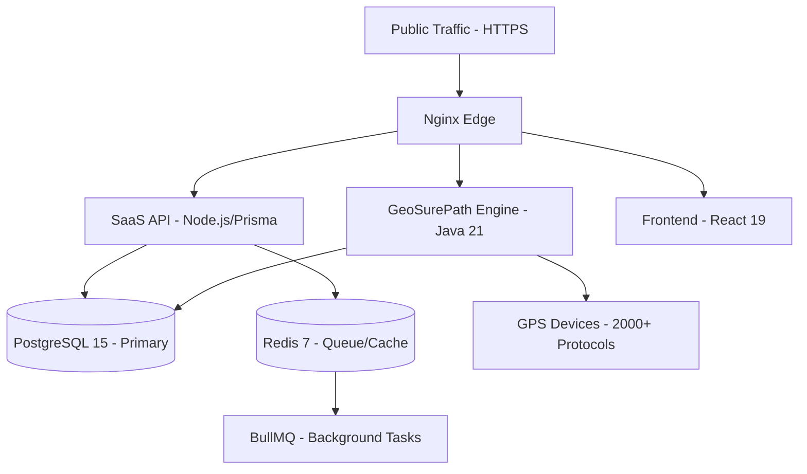

# 🛰️ GeoSurePath SaaS - Enterprise GPS Tracking Ecosystem

[](https://opensource.org/licenses/Apache-2.0)
[]()
[]()

**GeoSurePath** is a high-performance, enterprise-grade SaaS infrastructure designed for global vehicle tracking. built for massive scale, it wraps the industry-leading **Traccar** core in a modern, secure SaaS layer with advanced billing, AI-driven guardianship, and real-time safety controls.

---

## 🏗️ Premium Infrastructure
GeoSurePath uses a modular, high-availability architecture designed for zero-latency operations.



### Infrastructure Stack:
- **Core Engine**: Java 21 (Traccar Core) - Industrial protocol processing.
- **SaaS Layer**: Node.js 20 with Express & Prisma ORM.
- **Frontend**: React 19 + MUI - Premium Dark/Glassmorphic interface.
- **Safety Agent**: **AI-Guardian** - Self-healing background system maintenance.
- **Database**: PostgreSQL 15 - Optimized for high-frequency position logging.

---

## 💎 Safety & Security Ecosystem

### 🛡️ Intelligent Protection
- **Safe Parking (Engine Lock)**: 1-click 15m radius micro-perimeter with auto-purge.
- **Remote Immobilization**: Secure engine cut-off and resume commands with safety logic.
- **AI-Guardian**: Automated database pruning (180-day retention) and server-log offloading.
- **Ignition Pulse**: High-precision monitoring of engine status synced with telemetry events.

### 🔔 Smart Notifications
- **Auditory UI**: Custom **Web Audio API** alerts with 5 distinct context-aware tones.
- **Omni-Channel Alerts**: Push notifications, Telegram, WhatsApp API, and SMS.
- **Live Dash**: High-fidelity Toast notifications with low-latency event delivery.

---

## 💼 Enterprise SaaS Features
- **Razorpay Integrated Billing**: Automated tiered subscription and license lifecycle management.
- **Fleet Admin Panel**: Global health monitoring, user approval, and resource scaling.
- **Advanced Reports**: Sub-second history loading for trips, stops, and sensor telemetry.

---

## 🚀 Rapid Deployment (AWS Lightsail / Ubuntu)

### 1. Zero-Touch Installation
Run the automated installer on a fresh Ubuntu 22.04/24.04 instance:
```bash
wget -qO- https://raw.githubusercontent.com/sushantjagtap5543/track/main/install.sh | bash
```

### 2. Manual Docker Launch
```bash
git clone https://github.com/sushantjagtap5543/track.git
# Configure secrets in .env
docker compose up -d --build
```

---

## 💾 System Maintenance
- **Backups**: Automated 7-day rolling SQL dumps in `/opt/track/backups/`.
- **Database Optimization**: AI-Guardian automatically manages indices and record retention.
- **Health Checks**: Integrated Docker health probes via `pg_isready` and `redis-cli`.

---

## 🛡️ Best Practices
- **Security**: Nginx level rate-limiting on `/api/auth/` and JWT-secured transit.
- **Efficiency**: Optimized TCP/UDP port mapping (5001-5150) for industrial sensors.

---

## 📄 License
This platform is licensed under the Apache License 2.0. Copyright (c) 2026 GeoSurePath.

Designed with ❤️ for Enterprise Fleet Resilience.
