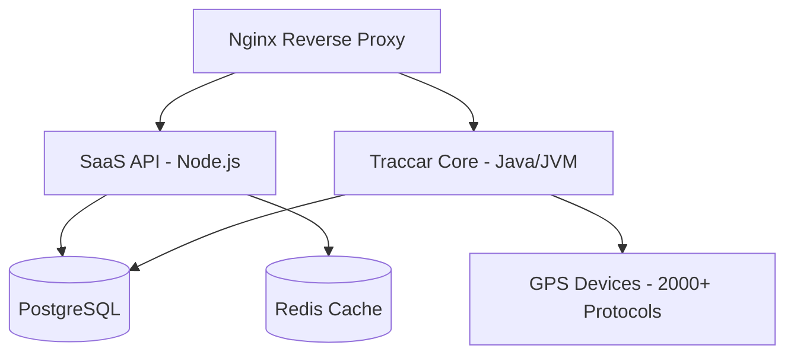

# 🛰️ GeoSurePath SaaS - Premium GPS Tracking Platform

[](https://opensource.org/licenses/Apache-2.0)
[]()
[]()

**GeoSurePath** is a state-of-the-art, high-performance SaaS platform for real-time GPS tracking and fleet management. Built on the industry-leading [Traccar](https://www.traccar.org) core, GeoSurePath enhances the experience with a premium sleek UI, robust SaaS-layer security, and advanced asset management features.

---

## ✨ Key Features

GeoSurePath provides a comprehensive suite of tools for both individual users and enterprise fleet managers.

### 🚗 Vehicle & Asset Management
- **Unified Dashboard**: Monitor your entire fleet from a single, high-fidelity map interface.
- **Custom Identifiers**: Track vehicles by **Vehicle Number Plate**, IMEI, or unique device IDs.
- **Telemetry Data**: Real-time updates on speed, battery voltage, fuel levels, and engine status (for supported protocols).
- **Asset Categories**: Effortlessly manage Cars, Trucks, Motorcycles, and industrial equipment with custom icons.

### 🛡️ Safety & Security
- **Safe Parking**: A one-click toggleable security feature that creates a virtual 15-meter perimeter around your vehicle's current location. Receive instant high-priority alerts for even minor movements, acting as a highly sensitive anti-theft shield.
- **Real-Time Alerts**: Instant notifications for engine starts, tampering, overspeeding, and geofence breaches.
- **Remote Control**: Send engine-stop and engine-resume commands (Relay control) directly from the dashboard.

### 💼 SaaS Ecosystem
- **Role-Based Access Control (RBAC)**: Distinct permissions for **Administrators** (Global view, system stats, billing) and **Clients** (Personal assets and settings).
- **Subscription Management**: Integrated billing with usage-based or tiered plans.
- **Detailed Reporting**: Export path history, stops, trips, and daily summaries in professional Excel formats.

---

## 🔔 Smart Notifications & Alerts

Never miss a moment with our robust multi-channel notification system.

### Trigger Events
Our system monitors and alerts you for various activities in real-time:
- **Movement**: 🟢 Device Online, 📡 Moving, 🛑 Stopped, 🔴 Offline.
- **Vitals**: ⚡ Battery Level (Low/Critical), 🔌 Power Cut, 🌡️ Temperature Alerts.
- **Performance**: 🚀 Overspeeding (Custom limits), ⛽ Fuel Drop/Increase (Theft detection).
- **Security**: 🔑 Ignition On/Off, 🚨 SOS/Panic Button, 📳 Vibration/Tamper Alert.
- **Maintenance**: 🛠️ Odometer-based service reminders, 🕒 Engine Hour maintenance.

### Delivery Channels
Receive alerts wherever you are through:
- **Mobile Push**: Native notifications via Firebase (FCM) and Traccar Manager.
- **Instant Messaging**: Integration with **Telegram Bot** and **WhatsApp Business API**.
- **Email & SMS**: Professional reports and urgent alerts delivered to your inbox or phone.
- **Web UI**: Real-time pop-up alerts with sound on the web dashboard.
- **Webhooks & Commands**: Trigger external APIs or execute server-side commands on specific events.

---

## 🗺️ Advanced Geofencing (Safe Zones)

Create virtual perimeters and monitor entries and exits with high precision.

### Geofence Types:
- **🔵 Circle**: Define a central point and a radius (e.g., Garage, Warehouse).
- **🔳 Polygon**: Create complex shapes to match specific boundaries (e.g., City limits, Construction site).
- **🛤️ Polyline (Route Tracker)**: Set a specific route path with a distance buffer. Perfect for corridor monitoring.

### Key Geofence Features:
- **Stay-In/Stay-Out**: Receive alerts when a vehicle enters restricted areas or leaves safe zones.
- **Speed Constraints**: Limit maximum speeds specifically within certain geofences.
- **Time-Based Geofences**: Schedule zones to be active only during certain hours or days.
- **Bulk Assignment**: Apply a single geofence to an entire fleet or specific groups with one click.

---

## 🎨 Premium UI/UX

GeoSurePath is designed for visual excellence. The dark-mode interface features glassmorphism elements, vibrant typography, and a "Live Map" experience that feels modern and responsive.


*Professional Dark Mode Dashboard*

---

## 🏗️ Technical Architecture

The platform uses a modular, containerized architecture for maximum reliability and scalability.



### Stack Overview
- **Frontend**: React + Material UI (Modern, responsive, and fast)
- **Backend API**: Node.js + Express + Prisma ORM
- **Tracking Engine**: Traccar Core (Industry Standard)
- **Database**: PostgreSQL (Unified storage)
- **Cache**: Redis (Fast status management)
- **Reverse Proxy**: Nginx (Rate limiting & SSL termination)
- **Protocol Support**: Compatibility with **2000+ protocols** (Teltonika, Queclink, Coban, Concox, etc.).

---

## 🌐 Live Access & Testing

- **Platform URL**: `http://localhost:8082/` (Local Development) or `http://3.108.114.12/` (Production)
- **Registration**: `http://localhost:8082/register`
- **Default Port Details**: 
  - Web UI: **8082**
  - GPS Device Ports: **5000-5150** (depending on protocol like Teltonika on 5027 or GT06 on 5023)

### 🧪 Test Accounts
Use these pre-configured credentials to explore the platform:

| Role | Email | Password |
| :--- | :--- | :--- |
| **Administrator** (Full Control) | `admin@geosurepath.com` | `admin` |
| **Client** (Asset Only) | `client@geosurepath.com` | `client` |

---

## 🚀 Installation & Deployment

### Local Development / Self-Hosting
1. **Prerequisites**: Node.js and Java (JDK 21+) or Docker.
2. **Build and Run (Local Windows)**:
   ```bash
   # Build the Web UI
   cd traccar-web
   npm install
   npm run build
   cd ..
   # Run the server
   ./gradlew.bat run
   # OR
   java -jar target/tracker-server.jar conf/traccar.xml
   ```
3. **Login Details**:
   Once the server starts on `http://localhost:8082`, use the **Register** button to create your first user. The *first user registered* automatically becomes the **Administrator**. You can then create your Client user for testing.
   Forgot Password functionality is also fully integrated into the Login page (Ensure SMTP settings are configured in Server Settings).

### Advanced UI Features Activated:
- **Ignition On/Off Control**: Map interface now includes quick commands to stop/resume engine. Sends relay commands automatically synced with GPS device status.
- **Nano Banana Vehicle Marker**: Select the premium `Nano Banana` top-view car marker from device settings (`Settings -> Device -> Category`) to change your default map icon.

### Troubleshooting
- **Database Logs**: `docker compose logs -f db`
- **Manual DB Update** (Enable Registration):
  ```bash
  docker exec -it geosurepath_db psql -U geosurepath -d geosurepath -c "UPDATE tc_servers SET registration = true;"
  ```

---

## 📄 License & Legal
GeoSurePath is licensed under the Apache License, Version 2.0. Copyright (c) 2026.

Designed with ❤️ for High-Performance Tracking.
