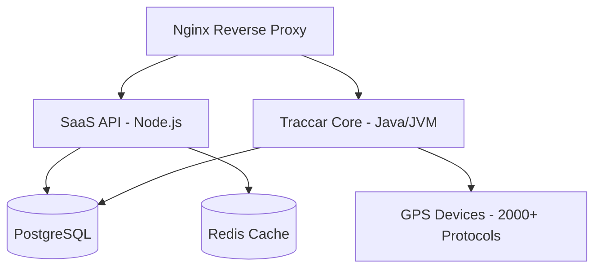

# 🛰️ GeoSurePath SaaS - Premium GPS Tracking Platform

[](https://opensource.org/licenses/Apache-2.0)
[]()
[]()

**GeoSurePath** is a state-of-the-art, high-performance SaaS platform for real-time GPS tracking and fleet management. Built on the industry-leading [Traccar](https://www.traccar.org) core, GeoSurePath enhances the experience with a premium sleek UI, robust SaaS-layer security, and advanced asset management features.

---

## ✨ Key Features

GeoSurePath provides a comprehensive suite of tools for both individual users and enterprise fleet managers.

### 🚗 Vehicle & Asset Management
- **Unified Dashboard**: Monitor your entire fleet from a single, high-fidelity map interface.
- **Custom Identifiers**: Track vehicles by **Vehicle Number Plate**, IMEI, or unique device IDs.
- **Telemetry Data**: Real-time updates on speed, battery voltage, fuel levels, and engine status (for supported protocols).
- **Asset Categories**: Effortlessly manage Cars, Trucks, Motorcycles, and industrial equipment with custom icons.

### 🛡️ Safety & Security
- **Safe Parking (Geofencing)**: Create virtual boundaries around your parking locations. Receive instant alerts if a vehicle leaves a "Safe Zone".
- **Real-Time Alerts**: Instant notifications for engine starts, tampering, overspeeding, and geofence breaches.
- **Remote Control**: Send engine-stop and engine-resume commands directly from the dashboard.

### 💼 SaaS Ecosystem
- **Role-Based Access Control (RBAC)**: Distinct permissions for **Administrators** (Global view, system stats, billing) and **Clients** (Personal assets and settings).
- **Subscription Management**: Integrated billing with usage-based or tiered plans.
- **Detailed Reporting**: Export path history, stops, trips, and daily summaries in professional Excel formats.

---

## 🎨 Premium UI/UX

GeoSurePath is designed for visual excellence. The dark-mode interface features glassmorphism elements, vibrant typography, and a "Live Map" experience that feels modern and responsive.


*Professional Dark Mode Dashboard*

---

## 🏗️ Technical Architecture

The platform uses a modular, containerized architecture for maximum reliability and scalability.



### Stack Overview
- **Frontend**: React + Material UI (Modern, responsive, and fast)
- **Backend API**: Node.js + Express + Prisma ORM
- **Tracking Engine**: Traccar Core (Industry Standard)
- **Database**: PostgreSQL (Unified storage)
- **Cache**: Redis (Fast status management)
- **Reverse Proxy**: Nginx (Rate limiting & SSL termination)

---

## 🌐 Live Access & Testing

- **Platform URL**: [http://3.108.114.12/](http://3.108.114.12/)
- **Registration**: [http://3.108.114.12/register](http://3.108.114.12/register)

### 🧪 Test Accounts
Use these pre-configured credentials to explore the platform:

| Role | Email | Password |
| :--- | :--- | :--- |
| **Administrator** | `admin@geosurepath.com` | `AdminTestPassword123!` |
| **Client** | `client@geosurepath.com` | `ClientTestPassword123!` |

---

## 🚀 Installation & Deployment

### Local Development / Self-Hosting
1. **Prerequisites**: Docker, Docker Compose, and Node.js (for local tweaks).
2. **Clone & Setup**:
   ```bash
   git clone https://github.com/sushantjagtap5543/track.git
   cd track
   ```
3. **Environment Setup**:
   Create a `.env` in the root and in `saas/`. Use the `.env.example` templates provided.
4. **Deploy**:
   ```bash
   chmod +x install.sh
   ./install.sh
   ```

### Troubleshooting
- **Database Logs**: `docker compose logs -f db`
- **SaaS API Status**: `docker compose logs -f saas-api`
- **Manual DB Update** (Enable Registration):
  ```bash
  docker exec -it geosurepath_db psql -U geosurepath -d geosurepath -c "UPDATE tc_servers SET registration = true;"
  ```

---

## 📄 License & Legal
GeoSurePath is licensed under the Apache License, Version 2.0. Copyright (c) 2026.

Designed with ❤️ for High-Performance Tracking.
