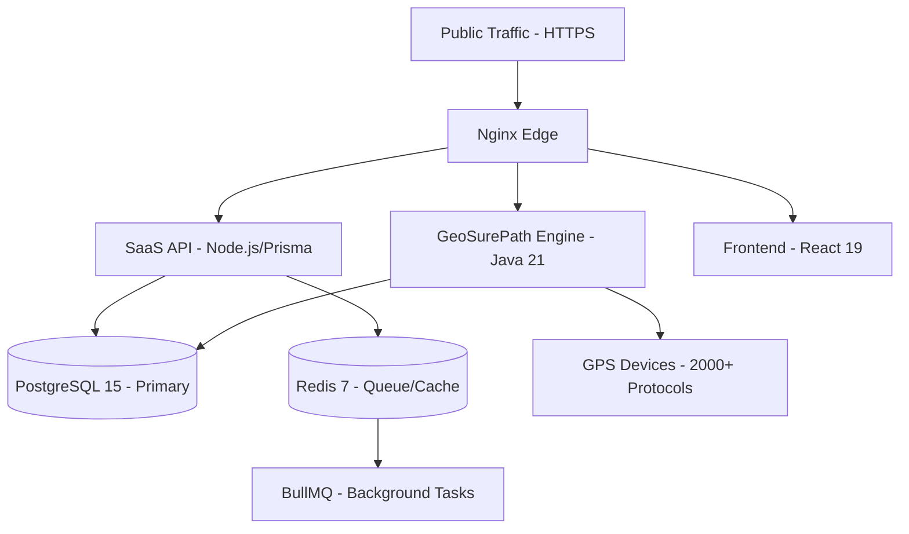

# 🛰️ GeoSurePath SaaS - Enterprise GPS Tracking Ecosystem

[](https://opensource.org/licenses/Apache-2.0)
[]()
[]()

**GeoSurePath** is a high-performance, enterprise-grade SaaS infrastructure designed for global vehicle tracking. Built for massive scale, it wraps the industry-leading **Traccar** core in a modern, secure SaaS layer with advanced billing, AI-driven guardianship, and real-time safety controls.

---

## 🏗️ Architecture & Capacity
GeoSurePath uses a modular, high-availability architecture designed for zero-latency operations.



### System Capacity:
- **Device Scaling**: Support for **thousands of concurrent GPS connections**.
- **Data Retention**: **180-day hot storage** for positions, with automated **Google Drive cold-archiving**.
- **Protocol Range**: 5001-5150 default range for industrial sensors.

---

## 🎛️ Admin Command Center (Manual)
The Admin dashboard provides global oversight and control over the entire fleet ecosystem.

### 👤 User & Fleet Management
- **Bulk Operations**: Create, delete, or update status for hundreds of users simultaneously.
- **Device Syncing**: Force synchronization between the SaaS layer and the Tracking Engine.
- **Impersonation Mode**: Securely log in as any user to troubleshoot issues or verify configurations.
- **Session Control**: View active user sessions and revoke access instantly (MFA reset support).

### 💰 Billing & Revenue
- **Advanced Analytics**: Real-time revenue reports, payment success rates, and debt tracking.
- **Razorpay Suite**: Manage gateway configurations, verify payments, and process refunds.
- **Manual Settlements**: Settle cash payments or adjust subscription expiry dates manually for offline transactions (Bulk Settle support).

### 🛡️ AIS 140 Government Compliance
- **RTO Approval**: Dedicated workflow for approving hardware devices for government tracking standards.
- **Inventory Tracking**: Manage AIS 140 certified device inventory and certificate numbers.
- **Data Forwarding**: Configure real-time forwarding to state/national government endpoints.

---

## 📱 Client Protection Portal (Manual)
The Client interface is designed for high-fidelity asset protection and real-time response.

### 🌍 Real-Time Dashboard
- **Universal Proxy**: High-speed, secure relay to the Traccar tracking engine for sub-second position updates.
- **Hardware Integration**: Support for engine immobilization (cut-off/resume) with safety logic.
- **Ignition Pulse**: Live monitoring of engine status (On/Off) synchronized with telemetry.

### 🔒 Safety Ecosystem
- **Safe Parking (Engine Lock)**: 1-click 15m radius geofence. Triggers immediate alerts if the vehicle moves.
- **AI-Guardian Alerts**: Context-aware security tones for tampering, geofence exit, and overspeeding.
- **Remote Immobilization**: Command-based engine control via secure API gateway.

### 🔔 Notifications & Self-Service
- **Auditory UI**: Custom web audio alerts with 5 distinct context-aware tones.
- **Push & SMS**: Integrated FCM (Firebase) for mobile push and WhatsApp/SMS alert delivery.
- **Self-Billing**: Manage subscriptions, download invoices, and upgrade plans via Razorpay.

---

## 💾 System Maintenance (AI-Guardian)
- **Database Optimization**: AI-Guardian manages indices and record retention (180 days).
- **Automated Backups**: 7-day rolling SQL dumps and Google Drive position archiving.
- **Health Checks**: Integrated Docker health probes via `pg_isready` and `redis-cli`.

---

## 🚀 Rapid Deployment
1. **One-Click Installation**:
   ```bash
   wget -qO- https://raw.githubusercontent.com/sushantjagtap5543/track/main/install.sh | bash
   ```
2. **Manual Launch**:
   ```bash
   git clone https://github.com/sushantjagtap5543/track.git
   cd track
   docker compose up -d --build
   ```

---

## 🛡️ Best Practices
- **Security**: Nginx level rate-limiting on `/api/auth/` and JWT-secured transit.
- **Efficiency**: Optimized TCP/UDP port mapping for industrial sensors.

---

## 📄 License
This platform is licensed under the Apache License 2.0. Copyright (c) 2026 GeoSurePath.
